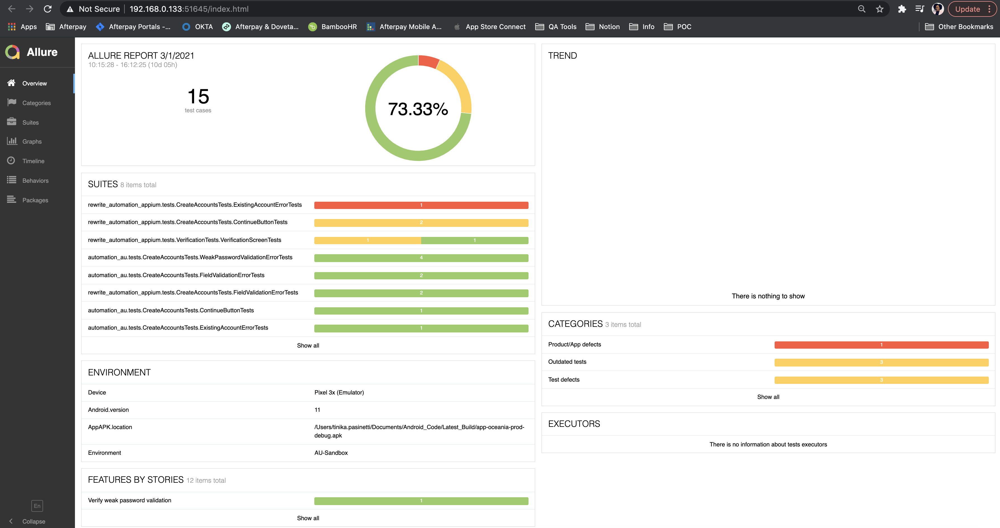
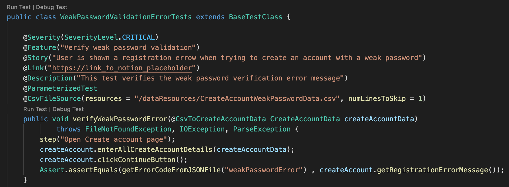
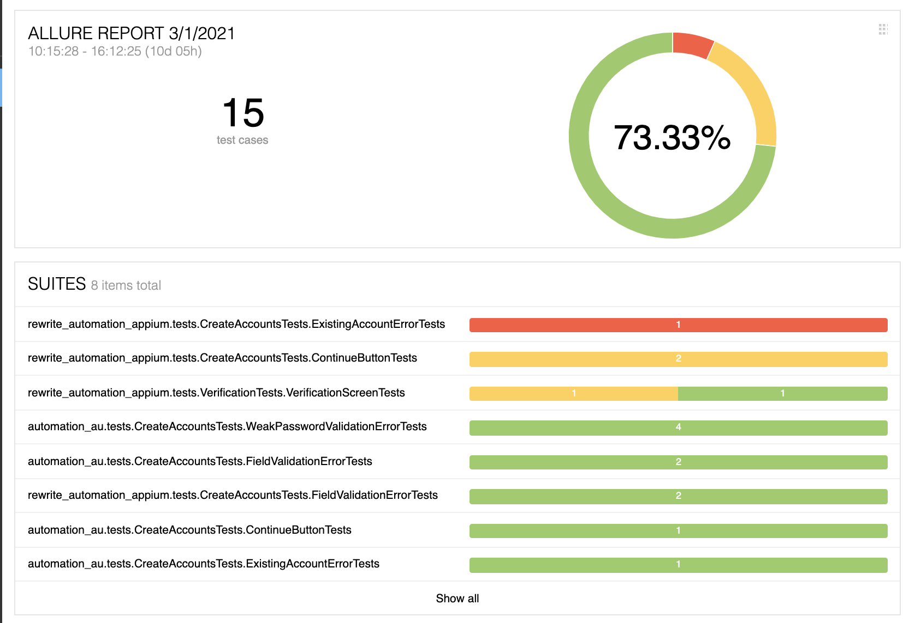
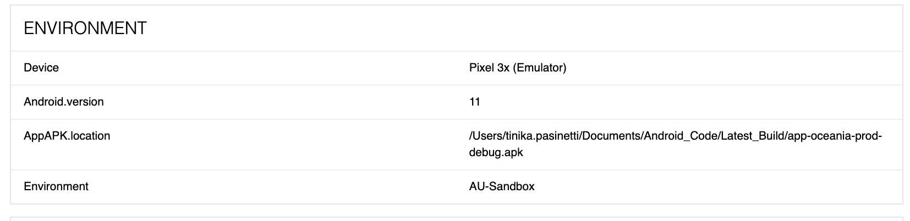
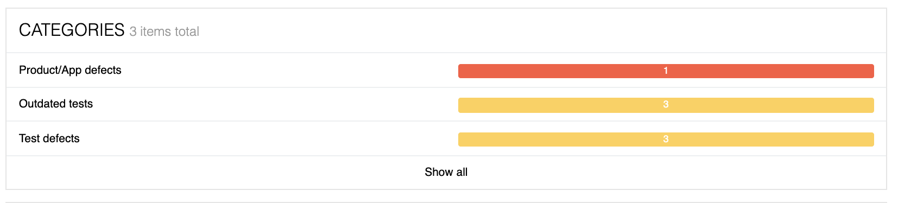
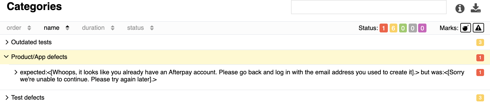
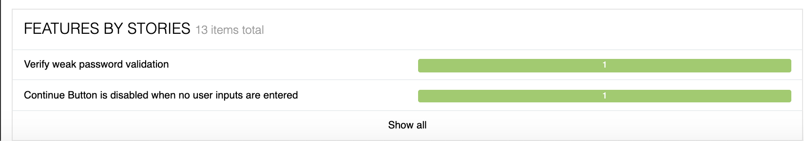

# Afterpay Re-Write Appium Automation Framework

This repo is a demo Appium POC for the Android app for the re-write project.

Sections:
- [Installations](#Installations)
- [Project-Structure](#Project-Structure)
- [Test-Structure](#Test-Structure)
- [Run-Tests](#Run-Tests)
- [Generate-Allure-Report](#Generate-Allure-Report)

## Installations

Installations needed:
1. VSCode
2. Appium desktop
3. Maven (use brew)
4. Java
5. Allure reports (use brew)

To get started follow this guide: https://code.visualstudio.com/docs/java/java-tutorial
The maven, allure reports, and Appium can just be downloaded from google

## Project-Structure

In the src/main/java/automation folder:

<b>/appium_infrastructure</b>
- This folder stores appium specific framework components and is responsible for creating and tearing down the appium driver
- It also has an appium helper class that stores common appium commands and takes in a ui component from the POM as an argument 
- The 

<b>/models</b>
- This folder stores common model classes to be used throughout the app including data models e.g. Complete registration data, login data etc

<b>/pages</b>
- In the pages folder, there is a subfolder for each page of the app
- Each folder then contains an interface class that stores all the methods of the page
- The other class is the POM class that stores the element locators and implements the interface methods

<b>/tests</b>
- This folder contains the actual tests, divided by functional area, also known as a test suite
- E.g. CreateAccountTests
- Inside the CreateAccountTests folder there are multiple classes that ggroup the tests e.g. FieldValidationErrorTests
 
<b>/tests/dataproviders</b>
- This folder has the data providers class that is used to populate the data in the parameterised tests

<b>/resources</b>
- The resources folder stores the CSV data files that are used for the parameterized tests
- All test data is to be entered here 
- The allure reports properties file is also in this folder that dictates allure reports config

<b>src/ErrorCodes.json</b>
This file contains json object containing the different error codes in the app that are used in assertions.
This provides a central location for error codes used in assertions to verify the strings are correct

E.g. of the JSON File

## Test-Structure
The tests are tagged with Junit and Allure report tags so that they are properly categorised/grouped for the report and for tets readability
The tags I have used are seen in the image below:

- Feel free to google allure report tags and add any that will be useful for reporting

The tests use a POM framework design pattern.

## Run-Tests
You can run them through the VSCode test lab or by navigating to the project folder where this repo is cloned and running the following commands via terminal:
 <b>1. Launch headless emulator:</b> 
   `/Users/tinika.pasinetti/Library/Android/sdk/emulator/emulator -avd Pixel_3a_API_30_x86 -no-audio -no-window  (change based on your system)`
 <b>2. Run tests in a specific suite:</b> 
   `mvn clean -Dtest="CreateAccountTests"  test`
   
   
## Generate-Allure-Report
Once you have run test cases, a folder in the project's target folder will contain another folder called 'allure-results'
To generate a HTML report that categorises defects, shows test steps, screenshots etc

 In the terminal enter the command : 'allure serve target/allure-results' 

This will automatically open a web browser with the test report with the results.
NOTE: To have a clean slate for reporting, instead of aggregated results, simply delete the json test result files from allure-results folder.
To stop the server instance running the report/to re-run...in terminal enter `Ctrl+C` and then re-run `allure serve target/allure-results` if needed.

  

The report has sections.
The first is the test suites section that shows the results for each suite (note: each suite is a class in the src code)

  

The next section is a configurable environments section that outlines the device, android version, and apk location. This is completely customisable and is dictated to via a .properties file in the project 'target/allure-results' folder. It is called environment.properties.

  

The next section is the categories section which is simply bugs/defects. When a test fails, depending on the failure (exception, or assertion error etc.) it will be categorised into a category that is customisable via categories.json file in the project 'target/allure-results' folder

  
When you click on one of the categories, it will display the actual causeof the failure and the difference in expected vs actual.

  

The last section is the stories section, and this reads and groups from the tag @feature that is written above the tests

  

